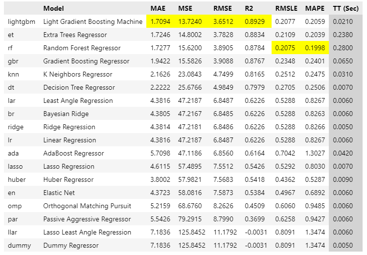
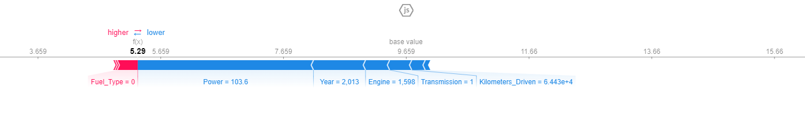
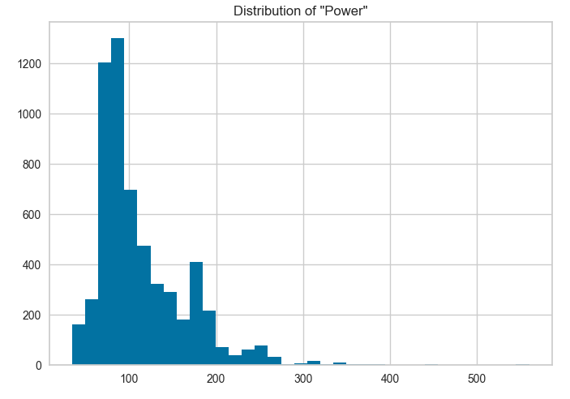
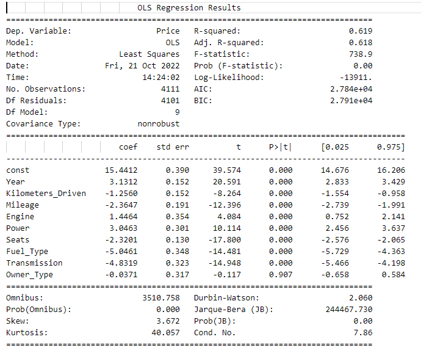
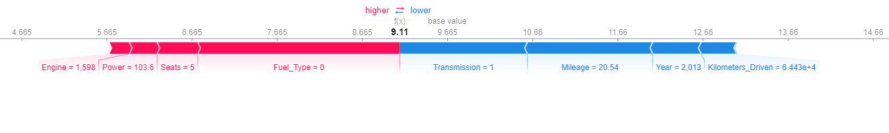

# Comparing-Boosted-and-Linear-Models-Using-SHAP-PyCaret-and-Sense-Checks

# Overview

<p align="justify">The aim of this project was to compare black-box models with more basic models like linear regression in the context of the accuracy vs. interpretability trade-off. Shapley values were used to take a peek into a high-performing decision tree regression model to show how complex models can sometimes fail some basic sanity checks while the same doesn’t happen in linear models. PyCaret was also used to experiment with the automation of machine learning workflows in order to speed up the model selection process.</p> 
<br/>  

# Data

Some basic data was taken from [Kaggle](https://www.kaggle.com/datasets/colearninglounge/used-cars-price-prediction?select=train.csv) for this experiment. 
<p align="justify">The chosen dataset is for predicting the prices of cars based on their physical attributes. The features in the dataset are: year, kilometres driven, fuel type, transmission, owner type, mileage (fuel efficiency in km/L), engine (size in CC), power (bhp) and number of seats. Fuel type, transmission and owner type are categorical variables and were set to binary for simplification. Fuel type was set to 1 for petrol and 0 for diesel, transmission was set to 1 for manual and 0 for automatic and owner type was set to 1 for first owner and 0 for any other owner type. The dataset contains 5,874 entries.</p> 

```python
# Import Libraries and Dataset
import pandas as pd
import numpy as np
data = pd.read_csv("cars.csv")

# Label Numerical & Categorical Features for Modelling
categorical = ["Fuel_Type", "Transmission", "Owner_Type"]
numerical= ["Year", "Kilometers_Driven", "Mileage", "Engine", "Power", "Seats"]
```
<br/>

# Modelling

### PyCaret

<p align="justify">The regression modelling was initially done using PyCaret. PyCaret is a library that’s used for automating machine learning workflows which saves the time that would be spent on creating multiple models.</p> 

<p align="justify">This proved to be a very effective tool, PyCaret has the capacity to run the data through many models all at once so that the results are easily comparable. Even if you wish to take more control over the modelling process and tune model parameters, PyCaret is still a great place to start as it gives a good idea of which models work best on the dataset. It also takes care of normalization & transformation of the data which is needed for linear models and it even imputes missing data if this functionality is turned on. </p>

```python
# Import Pycaret & Create Models
from pycaret.regression import *
reg = setup(data, target = "Price", normalize = True, transformation= True, categorical_features=categorical, numeric_features=numerical)
compare_models()
```


<p align="justify">Here we can see that the Light Gradient Boosting model has the best performance on our dataset, with a coefficient of 0.8929. This far out-performs the linear regression models in the middle of the table, which have an R2 of 0.6226. This is usually to be expected; decision-tree-based models are very powerful and often beat out linear models. This is especially true when gradient boosting is used, which is why these models are so popular in data science these days. However, let’s take a closer look at our winning model to see what’s happening behind the scenes.</p>

First let’s recreate our model:

```python
# Recreate the Top-Performing Model
from sklearn.model_selection import train_test_split
from sklearn.model_selection import cross_val_score

lightgbm = create_model('lightgbm')
X = reg[x_index]
y = reg[y_index]
X.columns = [X.columns[i].replace("_1", "") for i in range(0, len(X.columns))]
x_train, x_test, y_train, y_test = train_test_split(X, y, test_size = 0.3, random_state = 35)

lightgbm.fit(x_train, y_train)
lightgbm_cv = cross_val_score(estimator = lightgbm, X = x_train, y = y_train, cv = 10).mean()
print("Average R2 Score: {:.2f}%".format(lightgbm_cv*100))
```
Average R2 Score: 90.14%

<p align="justify">Now we can take at how our model is using the given features to make predictions. A very useful tool for this is SHAP.</p>
<br/>

### Shapley Values:

<p align="justify">The concept of Shapley values is taken from game theory and is often used in machine learning to give a better understanding of how each variable in a dataset contributes to the final prediction. While this is not needed in linear regression models given the availability of the coefficients, it’s very useful in black-box models to give the user a better understanding of what’s happening. 
 
```python
# Create Shapley Values & Plot for LightGBM
import shap
shap.initjs()
ex = shap.TreeExplainer(lightgbm)
shap_values_ = ex.shap_values(X)
shap_values = pd.DataFrame(shap_values_, index = X.index, columns = X.columns)
i = 8
feat = data[x_train.columns].loc[i]
shap_val = shap_values.iloc[i].to_numpy()
shap.force_plot(ex.expected_value, shap_val, features = feat, feature_names = X.columns)
```



<p align="justify">Here we can see a Shapley plot for one prediction and how our LightGBM model uses these feature/value pairs to make this prediction. In this case the predicted price of $5,290 is much lower than the average prediction of $9,659. Interestingly, the biggest contributing feature/value pair to the low predicted price was a power of 103.6 bhp. This value for power doesn’t seem so low that it should be contributing to a low predicted price, let’s take a look at a histogram of the ‘Power’ data to see.

```python
# Check Histogram of "Power"
import matplotlib.pyplot as plt
plt.hist(data["Power"], bins = 35)
plt.title('Distribution of "Power"')
plt.show()
```



<p align="justify">We can see here that by no means is this value in the tails of the distribution. There’s about 3,400 values less than 103.6 bhp and 2,400 values greater than it. Assuming a positive and significant correlation between power and price (we’ll test this later) it’s surprising that this power didn’t help contribute to an average or greater than average price prediction. </p>

<p align="justify">Let’s take a more holistic view of the model by doing some sense checks.</p>
<br/>

### Sense Checks

<p align="justify">Sanity checks can be done to make sure that a model is performing in a way that makes logical sense. Given the ‘greedy’ nature of decision tree algorithms each decision may not entirely make logical sense and constraints may therefore be needed for the model depending on the required delivery of the project. </p>

<p align="justify">A simple check was done by taking a variable, adding 1 to each value of that variable, making predictions for before and after the change was made and then comparing the predictions. By using this method we are keeping all other variables constant so that there is no other variability influencing the result. For example, if we do a sense check on power then we would be comparing the same car model, year, transmission, mileage etc. except one prediction will be made with a lower value for power and the other prediction will be made for the exact same car but with a higher value for power. We would expect all predictions of one dataset to be higher than all the predictions from the other dataset, assuming the variable has a significant impact on the price.</p>

The following function was created for this:

```python
# Create Function to Run Sense Checks
def sense_check(model, data, col):

    df_before = data.copy()
    df_after = data.copy()

    df_after[col] = df_before[col] + 1

    pred_0 = model.predict(df_before)
    pred_1 = model.predict(df_after)

    results = []

    for i in range(0, len(pred_0)):
        if pred_0[i] >= pred_1[i]:
            results.append(i)
    
    return len(results)
```

<p align="justify">Now we’ll perform sanity checks on ‘Power’ and ‘Kilometres_Driven’. For power we would expect the same car but with higher power to be more expensive, and we would expect the same car but with more kilometres driven to be less expensive. </p>

```python
# Sanity Check for the 'Power' Variable
sense_check(lightgbm, X, "Power")
```
<p align="justify">Output: 102</p>
<br/>
<br/>


```python
# Sanity Check for the 'Kilometers_Driven' Variable
len(data) - sense_check(lightgbm, X, "Kilometers_Driven")
```
Output: 1435

<p align="justify">We can see here that our model failed 102 times for power and 1,435 times for kilometres driven, the latter being almost 25% of the entire dataset. This could end up being pretty significant if the output of a model had to be interpreted and explained. This is where linear regression comes in.</p>
<br/>
 
### Linear Regression

<p align="justify">Linear models are very simple but the benefit of using these models is that they are easily interpretable and explainable. The coefficients of a linear model show a very clear relationship between the dependent and independent variable and we can also get the p-values so we know which variables have a statistically significant impact on the predictions. Let’s take a look at the linear model.</p>

```python
# Get Coefficients & P-Values
import statsmodels.api as sm

lrsm = sm.add_constant(x_train)
est = sm.OLS(y_train, lrsm)
est_ = est.fit()
print(est_.summary())
```



We can see that every feature except owner type has a statistically significant impact on the output variable by looking at the p-values. We can also look at a Shapley plot for this model.  



<p align="justify">Using the same car (same row of data) as before we can see there's a big difference in the plots. In this case the power of 103.6 bhp is actually contributing to making the prediction higher, which is the opposite of what happened with the boosted model. This makes more sense based on our analysis of the 'power' variable earlier. We can also perform some sense checks on the linear model just to confirm:</p>

```python
# Sanity Check for the 'Power' Variable
sense_check(lr, X, "Power")
```
<p align="justify">Output: 0</p>

<br/>
<br/>

```python
# Sanity Check for the 'Kilometers_Driven' Variable
len(data) - sense_check(lr, X, "Kilometers_Driven")
```
Output: 0

<p align="justify">This was an obvious result if we know how the model works. If a feature has a positive coefficient (which we do in the case of power) then adding to the power will 100% of the time have an additive impact on the predicted value. Likewise, when we have a negative coefficient like with kilometres driven, adding to the feature will always reduce the price. This basic logic that applies to linear models can help us to create a simple, actionable message when explaining a model to a client. Depending on the dataset and project, this could be very valuable.</p>
<br/>

###	Constraints

<p align="justify">So now we know that our linear model can be used to easily explain our results in simple terms, however there is still a problem with the accuracy. The linear regressor only gets an average R2 of 61.92%, which doesn’t even compare to the boosted model. 
Luckily we can apply some constraints to the boosted model so that it passes the sense checks. These are called monotone constraints and are a built-in parameter of some boosted models, including our LightGBM model. </p>

```python
# Repeat LightGBM Model with Constraints
lgb = lightgbm
params = lightgbm.get_params()

# Create Constraints
cols = ["Power", "Kilometers_Driven", "Engine", "Mileage"]
constraints = [1 if col in cols else 0 for col in X.columns]
params['monotone_constraints'] = constraints

lgb.set_params(**params)
lgb_cv = cross_val_score(estimator = lgb, X = x_train, y = y_train, cv = 10).mean()
print("Average R2 Score: {:.2f}%".format(lgb_cv*100))
```
Average R2 Score: 86.47%

<p align="justify">The constraints did bring down the R2 score slightly from 90.14% to 86.47% but we can see that it still outperforms the linear model by a lot. Therefore, in this case we would be happy with using the constrained boosted model for making our predictions. 

The important thing to remember is that these results would vary wildly depending on the dataset being used, it's absolutely possible that the monotonic constraints on a boosted model could make the linear model the better choice. Ultimately the conclusion that we can draw is that a good data scientist will consider this trade-off and weigh the pros and cons of using each model. If it were the case that the constraints heavily weigh down the efficacy of the boosted model then it may be preferred to use the linear model as the final output.</p>
<br/> 

# Conclusions

- <p align="justify">There is a trade-off between model accuracy and interpretability/explainability. Boosted decision tree models are often able to make better predictions but are hard to interpret.</p>

- Shapley values can help us to look into black-box models like these and help understand what’s happening behind the scenes.

- We can constrain decision-tree based models so that they make more logical sense. This may reduce their accuracy but at least they will pass sanity checks just like a linear model.

- PyCaret is a very effective starting point when it comes to model selection. It saves a lot of time and the tool has amazing functionality.
